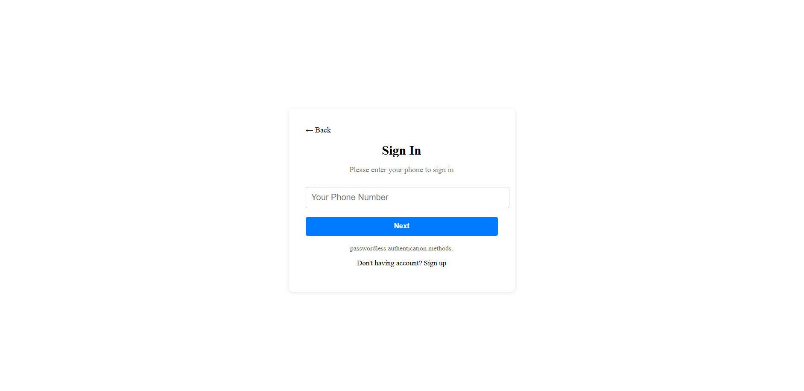
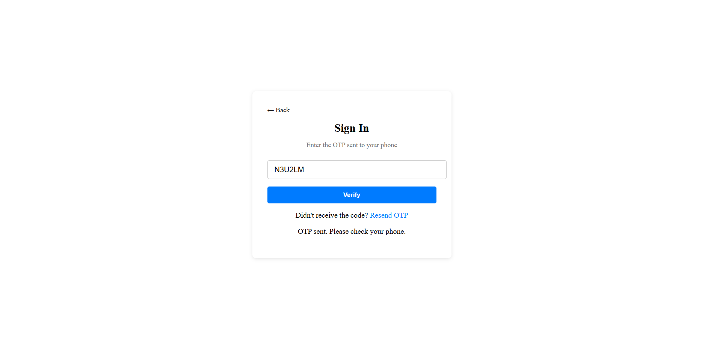
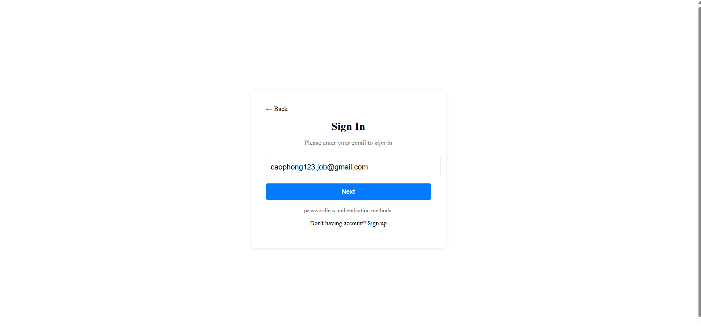
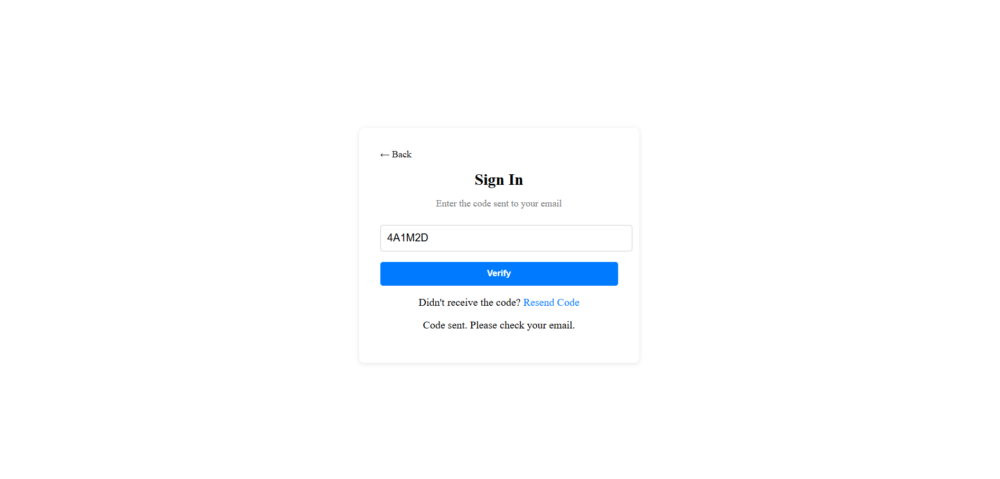
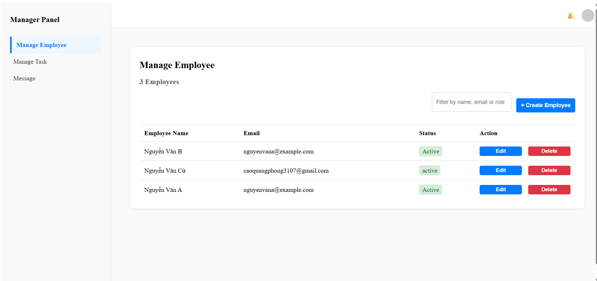
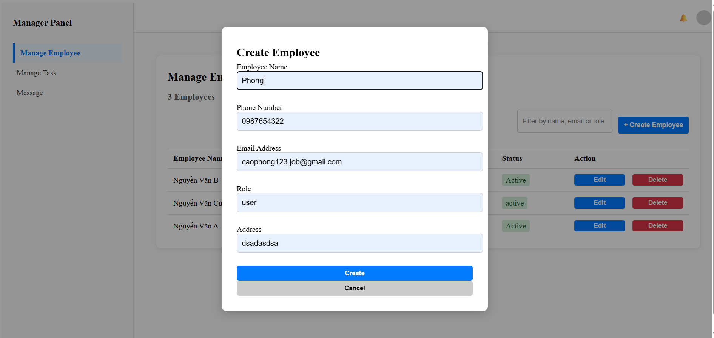
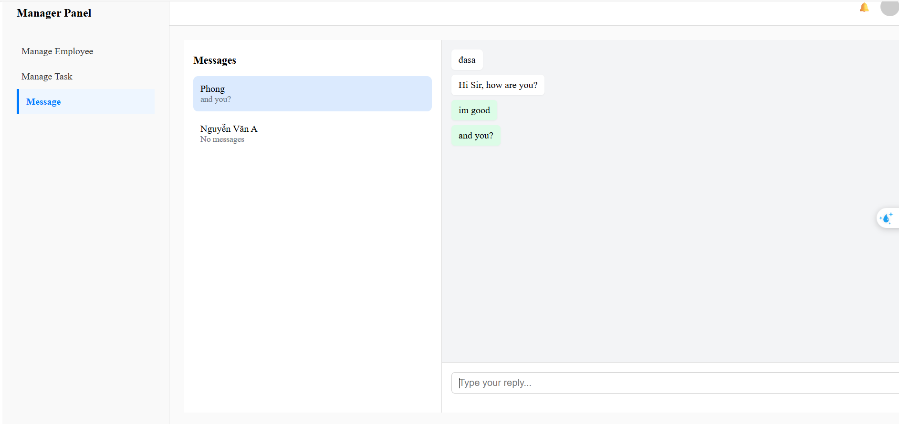
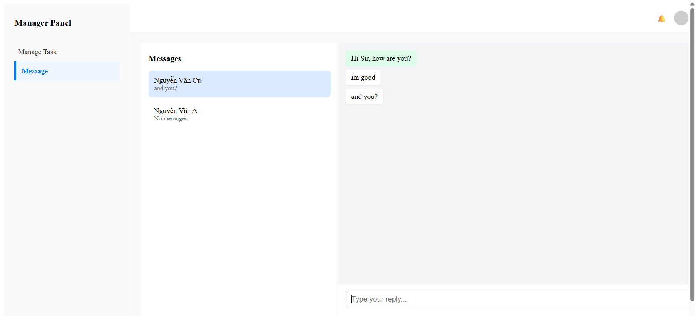

# Real-Time Employee Task Manager
 Screenshots
(Add your actual screenshots here!)








A full-stack application for managing employees, tasks, and real-time communication between managers and employees.

## Tech stack

- **Front-end:** React (Vite)
- **Back-end:** Node.js, Express.js
- **Database:** Firebase Realtime Database
- **Real-time:** Socket.io
- **Email/SMS:** Nodemailer, Twilio

---

##  Features

 **Authentication**

- Login by phone number (SMS) or email (email code)
- Token-based authentication (JWT)

 **Employee Management (Manager role)**

- Create, edit, delete employees
- Assign tasks
- Send email with credentials to new employees

 **Task Management**

- Managers can create tasks, assign them to employees
- Employees can see their assigned tasks
- Employees can mark tasks as complete

 **Real-time Chat**

- Managers and employees can chat in real-time using Socket.io
- Optionally store chat history in Firebase

 **Role-based Access Control**

- Front-end and API-level role checking

---

##  How to run the project

### 1. Clone the repo

```bash
git clone https://github.com/your-username/real-time-employee-task-manager.git
cd real-time-employee-task-manager
2. Install dependencies
Back-end
bash
Copy
Edit
cd back-end
npm install
Front-end
bash
Copy
Edit
cd ../front-end
npm install
3. Configure environment variables
Create a file .env in the back-end folder:

init

Copy
Edit
PORT=5000
FIREBASE_DB_URL=https://your-firebase-project.firebaseio.com
EMAIL_USER=your-email@gmail.com
EMAIL_PASS=your-email-app-password
TWILIO_ACCOUNT_SID=your-twilio-sid
TWILIO_AUTH_TOKEN=your-twilio-auth-token
TWILIO_PHONE_NUMBER=your-twilio-phone-number
JWT_SECRET=your-secret
Or use the provided .env.example and fill in your info.

4. Run the back-end
bash
Copy
Edit
npm start
The server will start on http://localhost:5000

5. Run the front-end
bash
Copy
Edit
cd ../front-end
npm run dev
The app will start on http://localhost:5173 (or whichever port Vite chooses)

🚀 API Endpoints
Auth
POST /api/auth/send-phone-code
Send a 6-digit SMS code

POST /api/auth/verify-phone-code
Verify phone code and return JWT

POST /api/auth/send-email-code
Send a 6-digit email code

POST /api/auth/verify-email-code
Verify email code and return JWT

Employees (Manager)
POST /api/employees — Create employee

GET /api/employees — Get all employees

GET /api/employees/:id — Get single employee

PUT /api/employees/:id — Update employee

DELETE /api/employees/:id — Delete employee

Tasks
POST /api/tasks — Create task

GET /api/tasks — List tasks

PUT /api/tasks/:id — Update task

DELETE /api/tasks/:id — Delete task

Chat
Real-time via Socket.io

Optional message history saved in Firebase

🗂️ Project Structure

/back-end
  /config
  /controllers
  /middlewares
  /routes
  /services
  /utils
  index.js
  .env

/front-end
  /src
      /components
      /features
      /page
      /service
      /styles
      /utils
    App.jsx
    main.jsx
  vite.config.js

 Notes
SMS can be replaced with email verification during testing.

For production, keep your .env secrets safe.

Remember to enforce role-based checks both in frontend and backend routes.

 Authors
Cao Quang Phong

---
